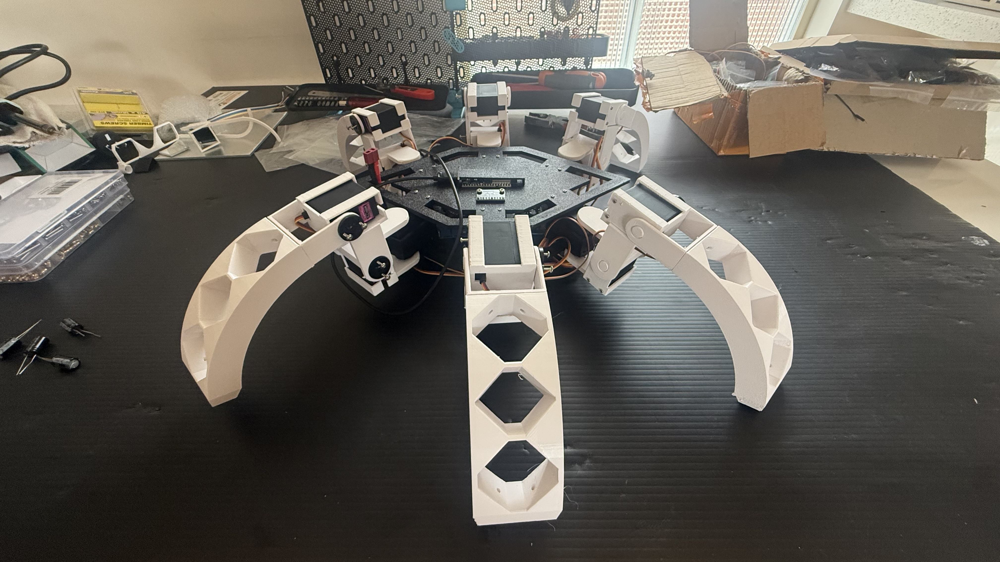
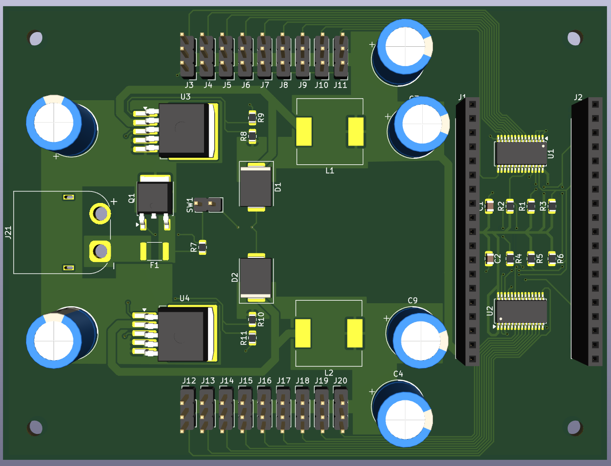
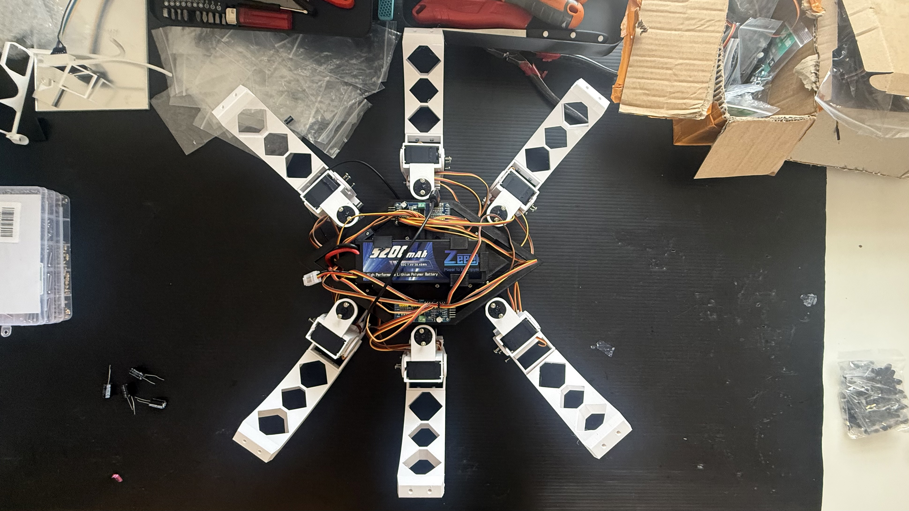

# MI-Hexapod: Autonomous 18-DOF Robot Architecture




**This is a walkthrough of a custom-fabricated hexapod robot engineered from scratch. This repository serves as a comprehensive case study documenting the mathematical kinematics, custom PCB fabrication, and firmware architecture used to bring this robotic platform to life.**

*(Note: This repository is structured as an architectural breakdown and hardware case study. Source code is omitted to focus on the engineering logic, mathematical models, and hardware implementation).*

---

## 1. Hardware Architecture & PCB Integration

Building an 18-DOF hexapod introduces significant electrical challenges. Standard servos can draw upwards of 2-3 Amps each under stall conditions. Trying to run 18 of them through breadboards or generic distribution boards results in severe voltage drops, logic resets, and melted wires.

### Custom KiCad PCB Design
To solve this, I designed and fabricated a custom PCB to serve as the central nervous system. 


*(Above: Top-down view of the custom servo control and power distribution board)*

**Power Routing & Current Management:**
The critical engineering challenge was managing the transient current spikes. If all 18 servos actuate simultaneously under load, the instantaneous current draw can exceed 30A. 
- **Isolated Logic and Motor Power:** The PCB features separate power planes for the logic controllers (3.3V/5V) and the servo motors (6V-7.4V) to prevent inductive voltage spikes from browning out the microcontroller.
- **Trace Width & Thermal Relief:** The main power traces feeding the servo headers were calculated and routed with maximum width, utilizing copper pours on both the top and bottom layers stitched with vias. This minimizes trace resistance and prevents the board from overheating under sustained walking loads.
- **Decoupling Capacitors:** Large electrolytic capacitors (1000uF) were placed physically close to each cluster of servo headers to act as local energy reservoirs, smoothing out the PWM switching noise and satisfying instantaneous current demands.


*(Clean wiring integration facilitated by the custom PCB)*

---

## 2. Software Architecture & Logic

Since direct code is omitted, this section details the theoretical and algorithmic foundation that powered the robot's movement. The software was strictly divided into two layers: a high-level Kinematics Engine (Python) and a low-level Firmware State Machine (C++).

### Inverse Kinematics (IK) Walkthrough

To move a leg to a specific coordinate in 3D space without manually guessing joint angles, an Inverse Kinematics solver is required. Each leg operates as a 3-DOF robotic arm with three joints: Coxa ($\theta_1$), Femur ($\theta_2$), and Tibia ($\theta_3$).

Given a target foot position $(x, y, z)$ relative to the coxa origin, the algorithm must calculate the required angles.

**1. Calculating the Coxa Angle ($\theta_1$)**
The coxa rotates the entire leg assembly in the horizontal plane (XY).
$$ \theta_1 = \arctan2(y, x) $$

**2. Calculating the 2D Plane Distance**
Once the coxa is rotated, the problem simplifies to a 2D plane involving the femur and tibia. We calculate the horizontal distance from the femur joint to the target:
$$ L_{prime} = \sqrt{x^2 + y^2} - L_{coxa} $$

**3. Applying the Law of Cosines for Femur ($\theta_2$) and Tibia ($\theta_3$)**
We find the straight-line Euclidean distance $D$ from the femur joint to the target foot position:
$$ D = \sqrt{L_{prime}^2 + z^2} $$

With $D$ representing the third side of a triangle formed by the Femur length ($L_{femur}$) and Tibia length ($L_{tibia}$), we apply the Law of Cosines to solve for the inner angles:
$$ \alpha = \arccos\left(\frac{L_{femur}^2 + D^2 - L_{tibia}^2}{2 \cdot L_{femur} \cdot D}\right) $$
$$ \beta = \arccos\left(\frac{L_{femur}^2 + L_{tibia}^2 - D^2}{2 \cdot L_{femur} \cdot L_{tibia}}\right) $$

The final servo angles ($\theta_2$ and $\theta_3$) are derived by adding geometric offsets depending on the physical resting position of the servo horns.

### Firmware State Machine & Tripod Gait

The hexapod walks using a **Tripod Gait**, where three legs are always on the ground providing a stable triangular base, while the other three legs swing forward. The C++ firmware operates as a non-blocking state machine to manage this orchestration.

```text
// Pseudocode: Tripod Gait State Machine Execution

State: TRIPOD_GAIT_INIT
1. Read target velocity and direction from input buffer.
2. Divide the 6 legs into two alternating groups:
   - Group A (Legs 1, 4, 5) 
   - Group B (Legs 2, 3, 6)
3. Calculate IK trajectories for Group A (Z-axis lift and XY swing forward).
4. Calculate IK trajectories for Group B (Z-axis planted, XY push backward).
5. Transition to State: TRIPOD_GAIT_EXECUTE

State: TRIPOD_GAIT_EXECUTE
1. Interpolate current joint angles towards calculated target angles.
2. Dispatch synchronized PWM signals to all 18 servos via I2C hardware timer (e.g., PCA9685).
3. Check if target positions are reached.
   - If YES: Swap Group A and Group B roles, transition back to TRIPOD_GAIT_INIT.
   - If NO: Yield to main loop (non-blocking) and continue interpolation on next cycle.
```

This state machine ensures that the servos never collide, and by using non-blocking delays (checking timers rather than `delay()`), the microcontroller remains free to read sensors or communication buses while the robot is actively moving.

---

## 3. Future Autonomy Pipeline

This hardware platform was designed to be easily extensible. The next phases of development include:
- **Spatial Sensors:** Integration of a 6-axis IMU (e.g., MPU6050) to dynamically adjust the Z-height of individual legs, allowing the hexapod to self-level on uneven terrain.
- **Computer Vision & SLAM:** Mounting a depth camera and offloading high-level path planning to an onboard companion computer (like a Raspberry Pi or Jetson Nano) running ROS 2 for untethered autonomous exploration.
